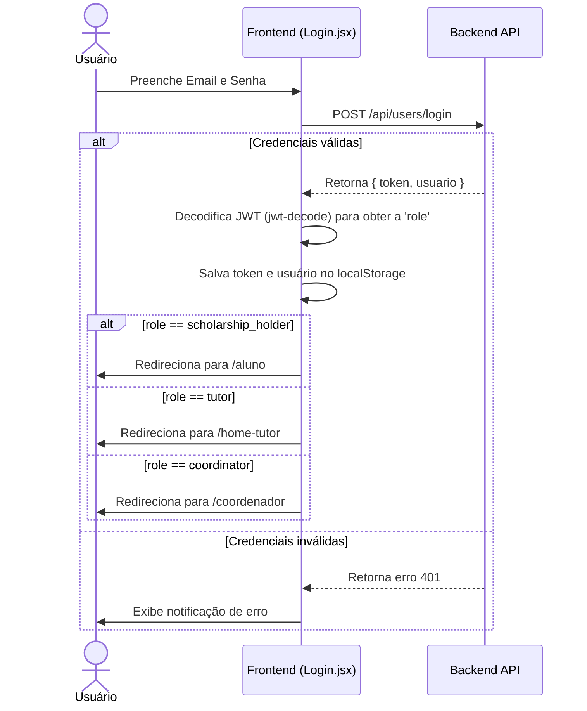
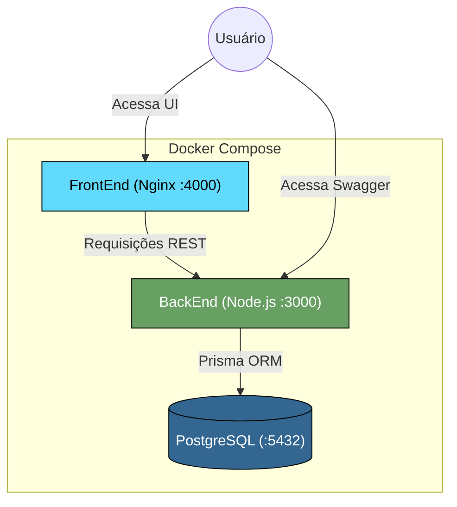

# NextCertify

**NextCertify** é um sistema web de gerenciamento de certificados e acompanhamento de tutoria acadêmica, desenvolvido para facilitar o controle, validação de certificados e o acompanhamento de alunos em programas de tutoria.

## 📋 Sobre o Projeto

O NextCertify é a interface de usuário (SPA) que se comunica com uma API REST (BackEnd) para gerenciar todo o fluxo de tutoria acadêmica. O sistema possui diferentes níveis de acesso baseados em roles:

- **Aluno** (`scholarship_holder`): Upload e acompanhamento de certificados, avaliação de tutorias
- **Tutor** (`tutor`): Acompanhamento de alunos vinculados, preenchimento de formulários de acompanhamento e visualização de relatórios
- **Coordenador** (`coordinator`): Gestão completa — registro de alunos e tutores, predefinições, validação de certificados, relatórios individuais e atribuição de papéis

> **Nota sobre nomenclatura:** No backend, a role do aluno é `scholarship_holder` (bolsista). Na interface do frontend, esse papel é exibido como **"Aluno"**. Toda menção a "bolsista" no código refere-se ao aluno no contexto do sistema.

## 🚀 Tecnologias Utilizadas

### Core
- **React** (v19.2.0) — Biblioteca JavaScript para construção de interfaces
- **Vite** (v7.2.4) — Build tool e dev server de alta performance
- **React Router DOM** (v7.9.6) — Roteamento SPA e navegação entre páginas

### UI/UX
- **Bootstrap** (v5.3.8) — Framework CSS para design responsivo
- **React Bootstrap** (v2.10.10) — Componentes Bootstrap para React
- **React Icons** (v5.5.0) — Biblioteca de ícones (FontAwesome, Material Design)

### Funcionalidades Específicas
- **jsPDF** (v4.0.0) — Geração de documentos PDF (certificados e relatórios)
- **jspdf-autotable** (v5.0.2) — Criação de tabelas em PDFs
- **Recharts** (v3.6.0) — Gráficos para visualização de dados nos relatórios
- **jwt-decode** (v4.0.0) — Decodificação de tokens JWT retornados pela API

### Ferramentas de Desenvolvimento
- **ESLint** (v9.39.1) — Linter para qualidade de código
- **@vitejs/plugin-react** (v5.1.1) — Plugin Vite para suporte a React

## 📦 Instalação e Execução

### Pré-requisitos
- Node.js (versão 18 ou superior)
- npm
- BackEnd rodando em `http://localhost:3000` (ver `docker-compose.yml` na raiz do projeto)

### Via Docker Compose (Recomendado)

Na raiz do projeto (`Next-Event/`), execute:

```bash
docker compose up --build
```

Isso sobe o banco de dados (PostgreSQL), o BackEnd (porta `3000`) e o FrontEnd (porta `4000`). Acesse `http://localhost:4000` no navegador.

### Desenvolvimento Local (sem Docker)

1. **Instale as dependências**:
```bash
cd FrontEnd
npm install
```

2. **Inicie o servidor de desenvolvimento**:
```bash
npm run dev
```

O Vite iniciará em `http://localhost:5173`. O frontend fará chamadas à API em `http://localhost:3000/api`.

### Build para Produção
```bash
npm run build
```
Os arquivos otimizados serão gerados na pasta `dist/` e servidos via Nginx no container Docker.

### Linting
```bash
npm run lint
```

## 📁 Estrutura do Projeto

```
FrontEnd/
├── public/                         # Arquivos públicos estáticos
├── src/                            # Código fonte
│   ├── components/                 # Componentes reutilizáveis
│   │   ├── AlertBox.jsx            # Exibe alertas com mensagem e variante
│   │   ├── BotaoPrincipal.jsx      # Botão estilizado padrão do sistema
│   │   ├── InputFlutuante.jsx      # Input com label flutuante (animated label)
│   │   ├── ModalSucesso.jsx        # Modal genérico de confirmação de sucesso
│   │   ├── NavbarRole.jsx          # Navbar dinâmica por role (não utilizado atualmente)
│   │   └── RecordsTable.jsx        # Tabela reutilizável de registros
│   ├── css/                        # Estilos CSS
│   │   ├── index.css               # Estilos globais
│   │   ├── forms.css               # Estilos de inputs com label flutuante
│   │   ├── form-pages.css          # Estilos de páginas com formulários
│   │   └── avaliacao-tutoria.css   # Estilos da página de avaliação
│   ├── hooks/                      # Custom React Hooks
│   │   ├── useAlert.jsx            # Gerenciamento de estado de alertas
│   │   └── useAuthenticatedUser.jsx # Autenticação, role e logout
│   ├── img/                        # Imagens estáticas (logos, ilustrações)
│   ├── mocks/                      # Dados mockados (legado, usados em relatórios gerais)
│   ├── pages/                      # Páginas da aplicação (detalhes abaixo)
│   ├── services/                   # Camada de serviços (chamadas à API)
│   │   ├── api.js                  # Função utilitária getData (legado)
│   │   ├── apiUrl.js               # URL base da API: http://localhost:3000/api
│   │   ├── authService.js          # Serviço de autenticação (legado, usa mocks)
│   │   ├── avaliacaoTutoriaService.js # Avaliações de tutoria (API real)
│   │   ├── certificateService.js   # CRUD de certificados (API real)
│   │   ├── formAcompanhamentoService.js # Formulários de acompanhamento (API real)
│   │   ├── predefinicoesService.js # Períodos, vínculos, carga horária (API real)
│   │   ├── relatorioService.js     # Relatórios individuais (API real)
│   │   └── roleService.js          # Gestão de usuários e papéis (API real)
│   ├── utils/                      # Funções utilitárias
│   │   └── formatter.js            # Formatação de CPF, matrícula, semestre, etc.
│   ├── App.jsx                     # Componente raiz com definição de rotas
│   └── main.jsx                    # Ponto de entrada (BrowserRouter + StrictMode)
├── Dockerfile                      # Build multi-stage (Vite → Nginx)
├── nginx.conf                      # Configuração Nginx com suporte a React Router
├── vite.config.js                  # Configuração do Vite
├── package.json                    # Dependências e scripts
└── README.md                       # Este arquivo
```

## 🔐 Autenticação e Fluxo de Login

O sistema utiliza autenticação baseada em **JWT (JSON Web Token)** integrada com o BackEnd.

### Fluxo de Autenticação



### Como funciona

1. **Login** (`Login.jsx`): Faz `POST http://localhost:3000/api/users/login` com `{ email, senha }`. O backend retorna um `token` JWT e os dados do `usuario`.
2. **Decodificação do Token**: O token JWT é decodificado com `jwt-decode` para extrair a `role` do usuário.
3. **Armazenamento**: O `token` e o objeto `usuarioLogado` (com a role) são salvos no `localStorage`.
4. **Proteção de Rotas**: O hook `useAuthenticatedUser` verifica se existe um `usuarioLogado` no localStorage. Se não existir, redireciona para `/` (login).
5. **Logout**: Limpa o `localStorage` e redireciona para `/`.

### Cadastro

O cadastro (`Cadastro.jsx`) faz `POST http://localhost:3000/api/users` com o payload:
```json
{
  "nome": "...",
  "email": "...",
  "senha": "...",
  "matricula": "...",
  "cpf": "...",
  "status": "ATIVO",
  "bolsista": {
    "anoIngresso": 2024,
    "curso": "Ciência da Computação"
  }
}
```

> **Nota:** O campo `bolsista` no payload de cadastro cria o perfil de aluno associado ao usuário no backend. Todo usuário cadastrado pelo formulário público recebe automaticamente o perfil de aluno (scholarship_holder).

### Roles e Mapeamento

| Role no Backend (JWT) | Nome exibido no Frontend | Rota Home |
|---|---|---|
| `scholarship_holder` | Aluno | `/aluno` |
| `tutor` | Tutor | `/home-tutor` |
| `coordinator` | Coordenador | `/coordenador` |

O mapeamento é feito pelo hook `useAuthenticatedUser` na função `userRole()`.

## 🛣️ Rotas da Aplicação

### Públicas (sem autenticação)
| Rota | Página | Descrição |
|---|---|---|
| `/` | `Login.jsx` | Login com email e senha |
| `/cadastro` | `Cadastro.jsx` | Cadastro de novo aluno |
| `/redefinir-senha` | `RedefinirSenha.jsx` | Solicitar redefinição de senha |
| `/verificar-codigo` | `VerificarCodigo.jsx` | Verificação de código de redefinição |
| `/contato` | `Contato.jsx` | Página de contato / atendimento |

### Aluno (`scholarship_holder`)
| Rota | Página | Descrição |
|---|---|---|
| `/aluno` | `HomeAluno.jsx` | Dashboard do aluno |
| `/meus-certificados` | `MeusCertificados.jsx` | Upload, listagem e acompanhamento de certificados |
| `/avaliacao-tutoria` | `AvaliacaoTutoria.jsx` | Formulário de avaliação mensal da tutoria |

### Tutor
| Rota | Página | Descrição |
|---|---|---|
| `/home-tutor` | `HomeTutor.jsx` | Dashboard do tutor |
| `/alunos-tutor` | `AlunosTutor.jsx` | Lista de alunos vinculados ao tutor |
| `/forms-tutor` | `FormsTutor.jsx` | Formulário de acompanhamento dos alunos |
| `/relatorios-tutor` | `RelatoriosTutor.jsx` | Registro de formulários concluídos e pendentes |

### Coordenador
| Rota | Página | Descrição |
|---|---|---|
| `/coordenador` | `HomeCoordenador.jsx` | Dashboard do coordenador |
| `/registro-aluno` | `RegistroAluno.jsx` | Listagem de alunos cadastrados |
| `/registro-tutores` | `RegistroTutores.jsx` | Listagem de tutores cadastrados |
| `/predefinicoes` | `Predefinicoes.jsx` | Gestão de períodos, carga horária e vínculos tutor-aluno |
| `/validar-certificados` | `ValidarCertificados.jsx` | Validação (aprovar/rejeitar) dos certificados dos alunos |
| `/relatorio-individual-tutor` | `RelatorioIndividualTutor.jsx` | Relatório individual por tutor |
| `/relatorio-individual-aluno` | `RelatorioIndividualAluno.jsx` | Relatório individual por aluno |
| `/atribuir-papel` | `AtribuirPapel.jsx` | Atribuição de papéis (tutor, coordenador) aos usuários |

> **Rotas comentadas (desativadas):** `/editar-perfil`, `/relatorio-geral-tutor`, `/relatorio-geral-aluno`, `/relatorios-coordenador` — estão desabilitadas no `App.jsx`.

## 🔌 Integração Frontend ↔ Backend (API)

A comunicação com o backend é feita pela API REST em `http://localhost:3000/api`. A URL base é configurada em `src/services/apiUrl.js`.

Todas as requisições autenticadas enviam o header `Authorization: Bearer <token>` obtido do `localStorage`.

### Camada de Serviços

Os arquivos em `src/services/` encapsulam as chamadas HTTP. Abaixo está o mapeamento completo entre os serviços do frontend e os endpoints do backend:

#### `certificateService.js` — Certificados
| Método | Endpoint | Descrição |
|---|---|---|
| `GET` | `/api/certificates/user/:userId` | Lista certificados do aluno |
| `POST` | `/api/certificates/upload` | Upload de certificado (FormData) |
| `DELETE` | `/api/certificates/:id` | Remove um certificado |
| `GET` | `/api/certificates/:id/download` | Download do arquivo PDF |
| `GET` | `/api/certificates` ou `/api/certificates?status=` | Lista todos os certificados (coordenador) |
| `PATCH` | `/api/certificates/:id/status` | Atualiza status (approved/rejected) |

#### `avaliacaoTutoriaService.js` — Avaliações de Tutoria
| Método | Endpoint | Descrição |
|---|---|---|
| `GET` | `/api/periodo-tutoria` | Lista períodos de tutoria ativos |
| `POST` | `/api/avaliacao-tutoria` | Cria uma avaliação de tutoria |

#### `predefinicoesService.js` — Predefinições e Vínculos
| Método | Endpoint | Descrição |
|---|---|---|
| `GET` | `/api/users/tutores` | Lista tutores |
| `GET` | `/api/users/bolsistas` | Lista alunos (bolsistas) |
| `GET` | `/api/users/` | Lista todos os usuários |
| `GET` | `/api/periodo-tutoria` | Lista períodos de tutoria |
| `POST` | `/api/periodo-tutoria` | Cria período de tutoria |
| `PUT` | `/api/periodo-tutoria/:id` | Atualiza período |
| `DELETE` | `/api/periodo-tutoria/:id` | Remove período |
| `POST` | `/api/carga-horaria-minima` | Define carga horária mínima |
| `GET` | `/api/carga-horaria-minima?periodoId=` | Lista cargas horárias por período |
| `DELETE` | `/api/carga-horaria-minima/:id` | Remove carga horária |
| `POST` | `/api/alocar-tutor-aluno` | Cria vínculo tutor ↔ aluno |
| `GET` | `/api/alocar-tutor-aluno?periodoId=&tutorId=&bolsistaId=` | Lista vínculos |
| `DELETE` | `/api/alocar-tutor-aluno/:id` | Remove vínculo |

#### `formAcompanhamentoService.js` — Formulários de Acompanhamento
| Método | Endpoint | Descrição |
|---|---|---|
| `POST` | `/api/form-acompanhamento` | Cria formulário de acompanhamento |
| `GET` | `/api/form-acompanhamento?tutorId=` | Lista formulários por tutor |

#### `roleService.js` — Gestão de Usuários e Papéis
| Método | Endpoint | Descrição |
|---|---|---|
| `GET` | `/api/users` | Lista todos os usuários |
| `PATCH` | `/api/users/:userId/atribuir-papel` | Atribui/remove papel do usuário |
| `POST` | `/api/alunos` | Cria perfil de aluno |
| `GET` | `/api/cursos` | Lista cursos disponíveis |

#### `relatorioService.js` — Relatórios Individuais
| Método | Endpoint | Descrição |
|---|---|---|
| `GET` | `/api/relatorios/individual/aluno/:id` | Relatório individual do aluno |
| `GET` | `/api/relatorios/individual/tutor/:id` | Relatório individual do tutor |

#### Chamadas diretas (sem service file)
| Página | Método | Endpoint | Descrição |
|---|---|---|---|
| `Login.jsx` | `POST` | `/api/users/login` | Login do usuário |
| `Cadastro.jsx` | `POST` | `/api/users` | Cadastro de novo usuário |

### Páginas que ainda utilizam mocks (legado)
As seguintes páginas ainda utilizam arquivos JSON locais da pasta `src/mocks/` e **não estão integradas com a API real**:

| Página | Mock utilizado |
|---|---|
| `RelatoriosCoordenador.jsx` | `relatorio-mock.json`, `auth-mock.json` |
| `RelatorioGeralTutor.jsx` | `relatorio-geral-tutor-mock.json`, `auth-mock.json` |
| `RelatorioGeralAluno.jsx` | `relatorio-geral-alunos-mock.json`, `auth-mock.json` |

> **Nota:** Os serviços `authService.js` e `api.js` na pasta services são legado e não são mais utilizados pelas páginas de Login e Cadastro, que agora fazem chamadas diretas ao backend.

## 🎨 Recursos e Funcionalidades

### Geração de PDFs
O sistema utiliza **jsPDF** e **jspdf-autotable** para exportar relatórios e certificados em formato PDF diretamente no navegador.

### Visualização de Dados
Gráficos e dashboards nos relatórios são criados com **Recharts** para visualização de métricas de acompanhamento.

### Design Responsivo
Interface totalmente responsiva utilizando **Bootstrap 5**, garantindo boa experiência em dispositivos móveis e desktop.

### Componentes Reutilizáveis
| Componente | Descrição |
|---|---|
| `AlertBox` | Exibe alertas temporários com variante (success, danger, warning) |
| `BotaoPrincipal` | Botão estilizado padrão com gradiente |
| `InputFlutuante` | Campo de entrada com label animada (floating label) |
| `ModalSucesso` | Modal genérico para confirmação de ação bem-sucedida |
| `RecordsTable` | Tabela reutilizável para listagem de dados |

### Utilitários (`src/utils/formatter.js`)
Funções de formatação para inputs com máscara:
- `formatCPF` — Formata CPF (000.000.000-00)
- `formatMatricula` — Limita matrícula a 6 dígitos
- `formatAdmisionYear` — Limita ano de ingresso a 4 dígitos
- `formatSemester` — Limita semestre a 2 dígitos
- `formatWorkload` — Limita carga horária a 3 dígitos

## 🐳 Deploy com Docker

A arquitetura do projeto quando executado via Docker Compose segue a seguinte estrutura:



O FrontEnd é construído em dois estágios no Dockerfile:

1. **Build** (Node 18): Executa `npm run build` gerando a pasta `dist/`
2. **Serve** (Nginx Alpine): Serve os arquivos estáticos com configuração de SPA (todas as rotas redirecionam para `index.html`)

O `nginx.conf` inclui suporte a React Router (`try_files $uri $uri/ /index.html`) e cache de arquivos estáticos.

### Portas (Docker Compose)
| Serviço | Porta Local | Porta Container |
|---|---|---|
| FrontEnd | `4000` | `80` |
| BackEnd | `3000` | `3000` |
| PostgreSQL | `5433` | `5432` |

### Documentação da API (Swagger)
Com os containers rodando, acesse a documentação interativa da API em:

```
http://localhost:3000/api-docs
```

## 🤝 Contribuindo

Para contribuir com o projeto:

1. Faça um fork do repositório
2. Crie uma branch para sua feature (`git checkout -b feature/MinhaFeature`)
3. Commit suas mudanças (`git commit -m 'Adiciona MinhaFeature'`)
4. Push para a branch (`git push origin feature/MinhaFeature`)
5. Abra um Pull Request